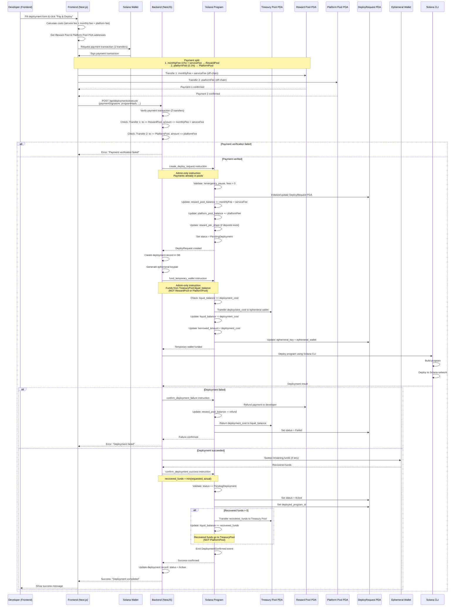
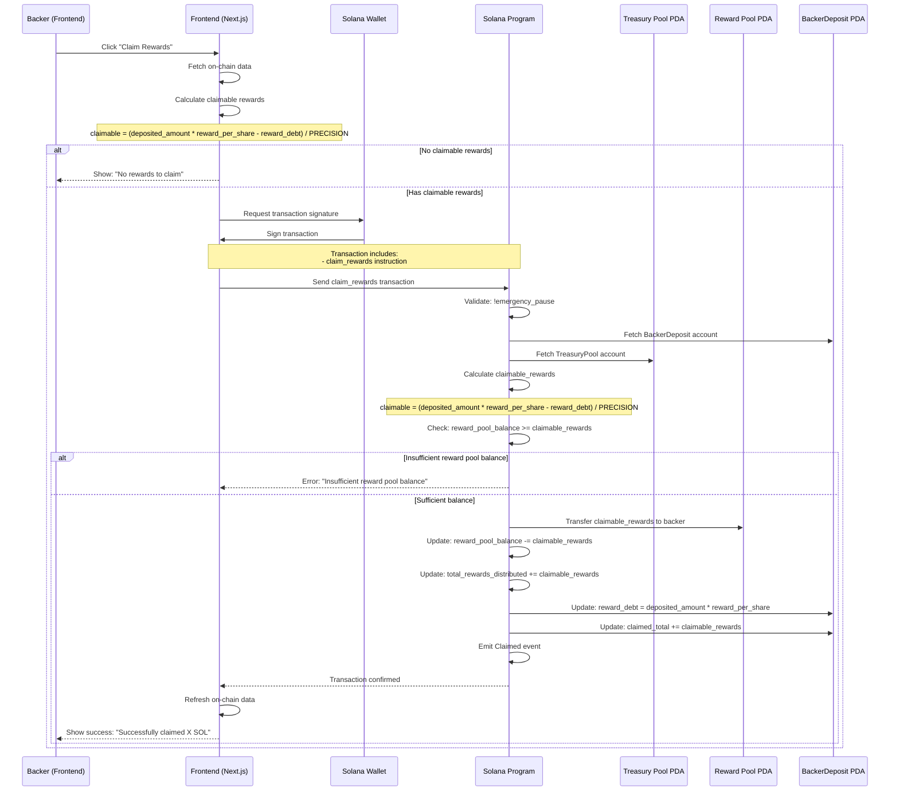
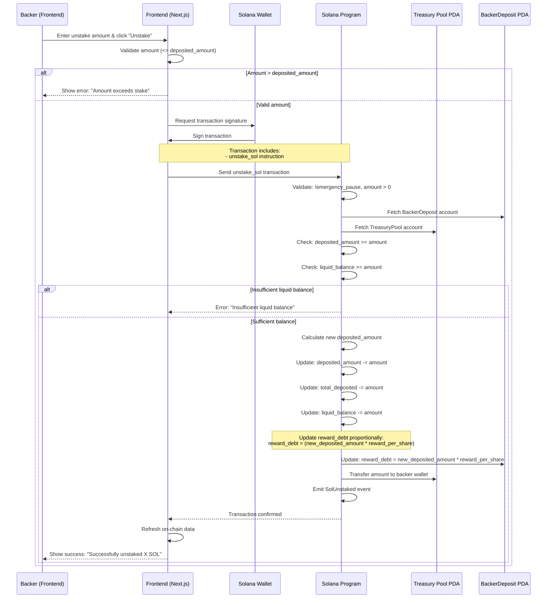
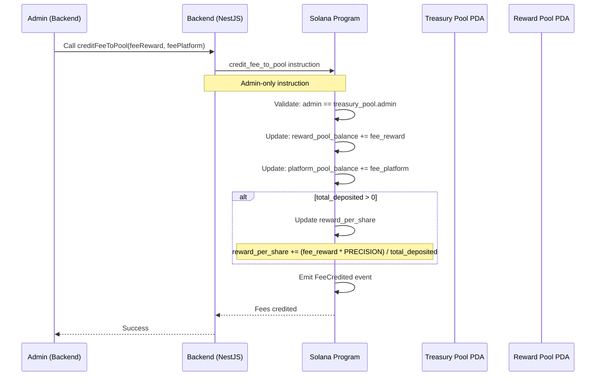
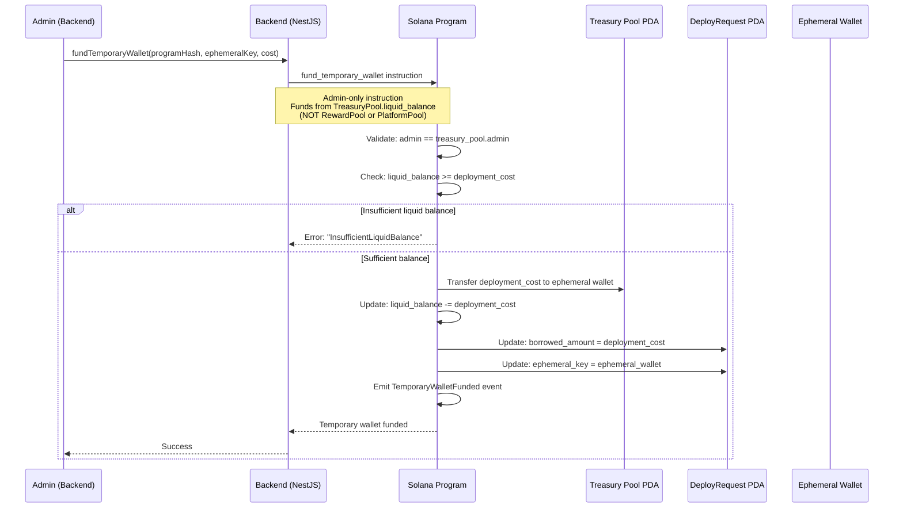
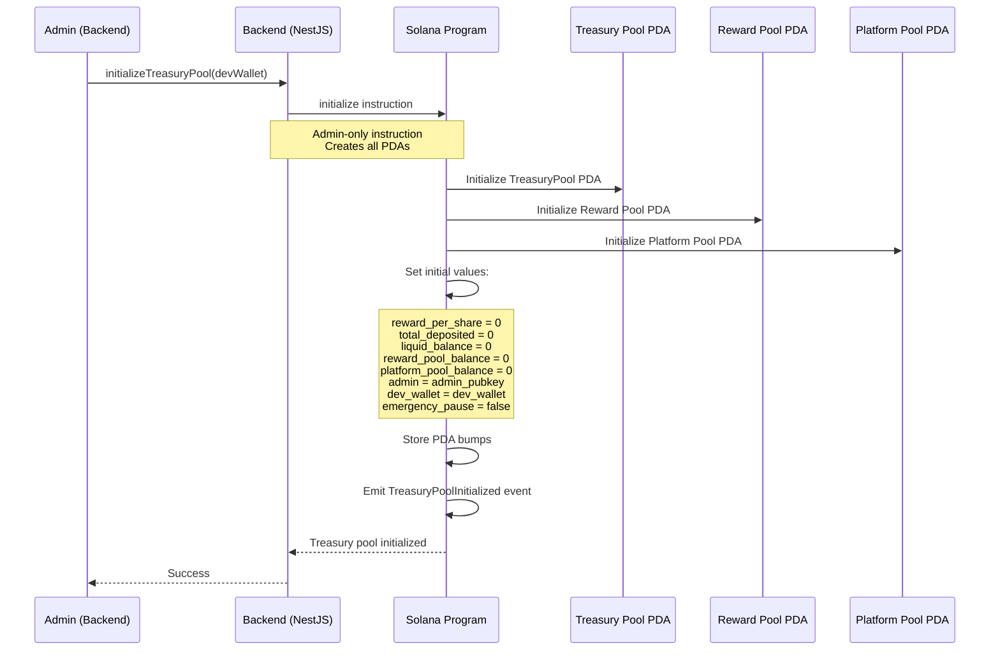
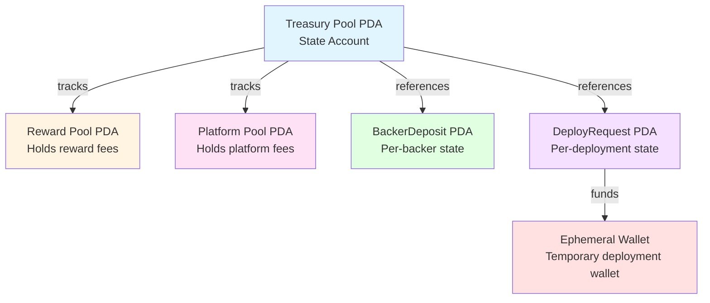
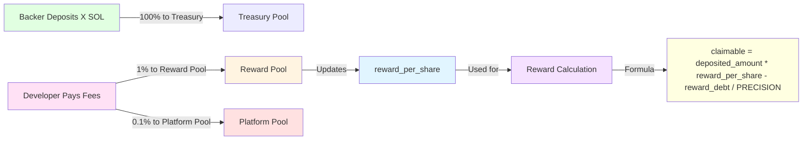

# D2D Program - Sequence Diagrams

This document contains Mermaid sequence diagrams for all major flows in the D2D (Developer-to-Deploy) platform.

## Table of Contents

1. [Backer Staking Flow](#1-backer-staking-flow)
2. [Developer Deployment Flow](#2-developer-deployment-flow)
3. [Reward Claiming Flow](#3-reward-claiming-flow)
4. [Unstake Flow](#4-unstake-flow)
5. [Admin Operations](#5-admin-operations)

---

## 1. Backer Staking Flow

Flow when a backer stakes SOL into the treasury pool.

```mermaid
sequenceDiagram
    participant B as Backer (Frontend)
    participant F as Frontend (Next.js)
    participant W as Solana Wallet
    participant P as Solana Program
    participant T as Treasury Pool PDA
    participant S as BackerDeposit PDA

    B->>F: Enter stake amount & click "Stake"
    F->>F: Validate amount (min 0.1 SOL)
    F->>W: Check wallet balance
    W-->>F: Balance + rent exemption estimate
    
    alt Insufficient balance
        F-->>B: Show error: "Insufficient balance"
    else Sufficient balance
        F->>W: Request transaction signature
        W->>F: Sign transaction
        
        Note over F,P: Transaction includes:<br/>- stake_sol instruction<br/>- deposit_amount (100% to Treasury, NO fees from backer)
        
        F->>P: Send stake_sol transaction
        P->>P: Validate: !emergency_pause, amount > 0
        P->>P: Check lender balance (deposit + rent + fees)
        
        alt Insufficient balance
            P-->>F: Error: "InsufficientDeposit"
        else Sufficient balance
            P->>P: Initialize/update BackerDeposit account
            
            alt New backer
                P->>S: Initialize BackerDeposit PDA
                Note over S: deposited_amount = 0<br/>reward_debt = 0<br/>is_active = true
            else Existing backer
                P->>S: Update reward_debt (settle pending rewards)
                Note over S: reward_debt = deposited_amount * reward_per_share
            end
            
            P->>P: Update: deposited_amount += deposit_amount
            P->>T: Transfer deposit_amount (100% to Treasury, NO fees)
            P->>P: Update: total_deposited += deposit_amount
            P->>P: Update: liquid_balance += deposit_amount
            P->>P: Update: reward_debt = deposited_amount * reward_per_share
        
        P->>P: Emit SolStaked event
        P-->>F: Transaction confirmed
        F->>F: Refresh on-chain data
        F-->>B: Show success: "Successfully staked X SOL"
    end
```

---

## 2. Developer Deployment Flow

Complete flow from developer payment to program deployment.



---

## 3. Reward Claiming Flow

Flow when a backer claims their accumulated rewards.



---

## 4. Unstake Flow

Flow when a backer unstakes (withdraws) their principal SOL.



---

## 5. Admin Operations

### 5.1. Credit Fees to Pool

Flow when admin credits fees to reward pool (after developer payment).



### 5.2. Fund Temporary Wallet

Flow when admin funds temporary wallet for deployment.



### 5.3. Initialize Treasury Pool

Flow when admin initializes the treasury pool for the first time.



---

## Architecture Overview

### Account Relationships



### Reward Calculation Model



---

## Notes

1. **Reward-Per-Share Model**: The system uses a reward-per-share accumulator pattern for efficient reward distribution without iterating through all backers.

2. **Fee Structure**:
   - Backers: No fees (100% of deposit goes to Treasury)
   - Developers: 
     - monthlyFee (1% monthly) + serviceFee → Reward Pool
     - platformFee (0.1% platform) → Platform Pool

3. **Pool Separation**:
   - **Treasury Pool**: Holds all backer deposits (principal), funds deployments, receives recovered funds
   - **Reward Pool**: Holds monthly fees + service fees (for rewards to backers)
   - **Platform Pool**: Holds platform fees (0.1% developer fees, admin operations)

4. **Deployment Flow**:
   - Payment split: monthlyFee + serviceFee → Reward Pool, platformFee → Platform Pool (off-chain)
   - Backend verifies 2 transfers in one transaction
   - Admin creates DeployRequest (credits fees to pools, updates reward_per_share)
   - Admin funds temporary wallet from TreasuryPool.liquid_balance (NOT RewardPool)
   - Backend deploys program
   - Admin confirms success/failure
   - Recovered funds go back to TreasuryPool.liquid_balance (NOT PlatformPool)

5. **Security**:
   - All admin operations require admin signature
   - Payment verification before creating DeployRequest
   - Liquid balance checks before withdrawals
   - Emergency pause mechanism available

